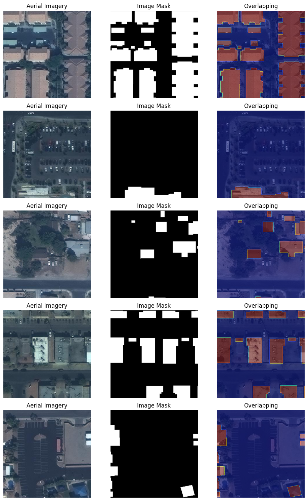
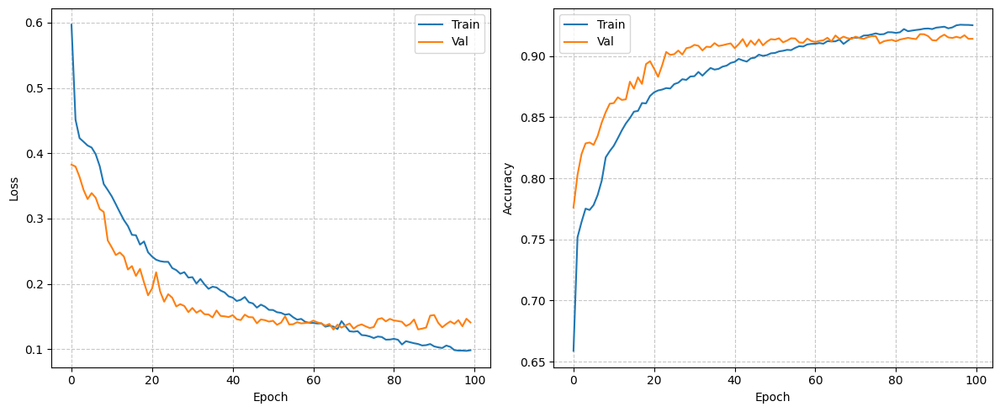
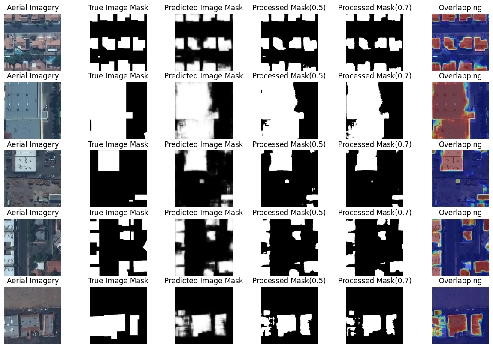

# U-Net语义分割模型实现建筑足迹提取

本项目基于PyTorch实现了U-Net语义分割模型，用于处理图像分割任务（以航空影像分割为例）。代码包含完整的数据加载、模型定义、训练流程及结果可视化功能，可直接用于相关分割任务或作为基础框架进行扩展。

## 环境依赖

- Python 3.9.7
- Tesla P100-PCIE-16GB
```
torch: 2.0.1+cu117
torchvision: 0.15.2+cu117
numpy: 1.24.4
pandas: 2.1.1
gdal: 3.6.2
```

- 训练过程中显存占用为：13GB

## 数据集准备

数据源：https://www.kaggle.com/datasets/utkarshsaxenadn/mapping-challenge-subset/data

1. 数据集需包含两类文件：原始图像（images）和对应的掩码图像（masks）
2. 图像和掩码需一一对应（建议文件名相同，放在不同文件夹）
3. 掩码图像为单通道灰度图，像素值表示类别（二值分割中通常为 0 或 255）



默认路径配置：
```
IMAGE_DIR = "MappingChallenge-Subset/images"
MASK_DIR = "MappingChallenge-Subset/masks"
```

## 模型说明

1. Encoder
    - 由4个编码块组成，每个块包含2次卷积+ReLU+Dropout。
    - 每个编码块后通过 MaxPool2d 进行下采样。
    - 输出用于跳跃连接的特征图。
2. Bottleneck
    - 包含2次卷积+ReLU+Dropout。
3. Decoder
    - 由4个解码块组成，每个块通过转置卷积(ConvTranspose2d)进行上采样。
    - 与编码器对应层的特征图拼接(跳跃连接)。
    - 包含2次卷积+ReLU+Dropout。
4. Output
    - 1x1卷积将特征图映射到目标通道数(二值分割为1)。
    - Sigmoid激活函数输出0-1的概率图。

## 使用说明

运行根目录的`U-Net.ipynb`文件，中间输出结果保存在文件夹`ModelProgress`中。

### 训练


### 结果

